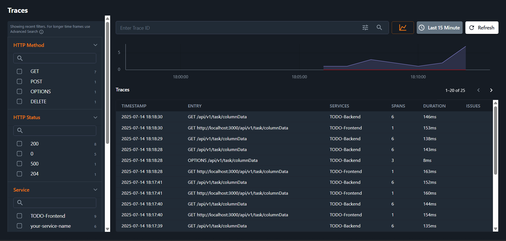

# Node.js Application with OpenTelemetry Instrumentation

This project demonstrates how to instrument a Node.js application with OpenTelemetry for collecting traces, metrics, logs and monitoring using Kloudmate.

## 🔧 Instrument Backend with Otel

### Step 1: Configure Environment Variables

Set up the following environment variables. You need to export them in your shell

```bash
export OTEL_TRACES_EXPORTER="otlp"
export OTEL_METRICS_EXPORTER="otlp"
export OTEL_EXPORTER_OTLP_ENDPOINT="https://otel.kloudmate.com:4318"
export OTEL_EXPORTER_OTLP_HEADERS="authorization=YOUR_PRIVATE_KEY"
export OTEL_NODE_RESOURCE_DETECTORS="env,host,os"
export OTEL_NODE_ENABLED_INSTRUMENTATIONS="http,express"
export OTEL_SERVICE_NAME="your-service-name"
export NODE_OPTIONS="--require @opentelemetry/auto-instrumentations-node/register"
```

**Important:** Replace `YOUR_PRIVATE_KEY` with your actual Kloudmate private key and set your-service-name accordingly.

### Step 2: Start the Backend

Start your Node.js app as usual (e.g., node src/index.js or npx nodemon src/index.ts). No code changes required if you use the above NODE_OPTIONS this will automatically instruments the backend.

## 🌐 Instrument Frontend with Otel

### Step 1: 📦 Add Required Dependencies

```bash
npm install @opentelemetry/api @opentelemetry/core @opentelemetry/sdk-trace-web @opentelemetry/exporter-trace-otlp-http @opentelemetry/instrumentation @opentelemetry/auto-instrumentations-web @opentelemetry/context-zone @opentelemetry/resources @opentelemetry/auto-configuration-propagators
```

### Step 2: Create instrumentation.js

Create `instrumentation.ts` inside the src folder of React application with the following configuration [instrumentation.ts](./frontend/src/instrumentation.ts)

**Important:** Replace `YOUR_PUBLIC_KEY` with your actual Kloudmate public key.
**Important:** Enter your Backend Url in the form of regex in place ```propagateTraceHeaderCorsUrls``` to both fetch and XMLHttpRequest configuration

### Step 3: Import instrumentaion.ts in the main.tsx file
```typescript
import './instrumentation.ts'
```

## ⚙️ Configuration Options

### Environment Variables

| Variable | Description |
|----------|-------------|
| `OTEL_TRACES_EXPORTER` | Trace exporter type |
| `OTEL_METRICS_EXPORTER` | Metrics exporter type |
| `OTEL_EXPORTER_OTLP_ENDPOINT` | Kloudmate OTLP endpoint |
| `OTEL_EXPORTER_OTLP_HEADERS` | Authorization header with private key |
| `OTEL_NODE_RESOURCE_DETECTORS` | Resource detectors to enable |
| `OTEL_NODE_ENABLED_INSTRUMENTATIONS` | Instrumentations to enable |
| `OTEL_SERVICE_NAME` | Your service name | Yes |
| `NODE_OPTIONS` | Node.js options for auto-instrumentation |

## ScreenShots
You can see traces and logs like this in our platform

### Traces


### Logs
