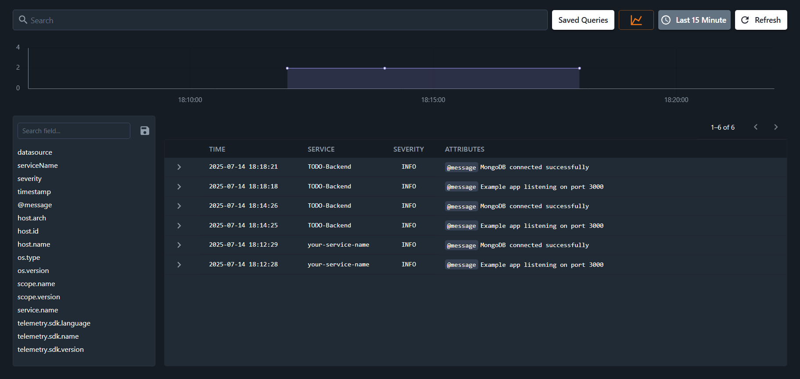

# Node.js Application with OpenTelemetry Instrumentation

This project demonstrates how to instrument a Node.js application with OpenTelemetry for collecting traces, metrics, logs and monitoring using Kloudmate.

## 📋 Prerequisites

- Node.js (v18 or higher)
- npm or yarn
- Kloudmate account with API keys

## 🛠️ Project Structure

```
project-root/
├── src/
│   └── index.ts
├── frontend/
│   ├── instrumentation.ts
│   └── ...
├── .env.example
├── package.json
└── README.md
```

## 🚀 Quick Start

### 1. Clone and Install

```bash
git clone <your-repository>
cd <project-directory>
npm install
```

### 2. Environment Configuration

Copy the example environment file:

```bash
cp .env.example .env
```

Fill in your configuration values in the `.env` file.

## 🔧 Backend Setup

### Step 1: Configure Environment Variables

Set up the following environment variables. You need to export them in your shell and run the command

```bash
export OTEL_TRACES_EXPORTER="otlp"
export OTEL_METRICS_EXPORTER="otlp"
export OTEL_EXPORTER_OTLP_ENDPOINT="https://otel.kloudmate.com:4318"
export OTEL_EXPORTER_OTLP_HEADERS="authorization=YOUR_PRIVATE_KEY"
export OTEL_NODE_RESOURCE_DETECTORS="env,host,os"
export OTEL_NODE_ENABLED_INSTRUMENTATIONS="http,express"
export OTEL_SERVICE_NAME="your-service-name"
export NODE_OPTIONS="--require @opentelemetry/auto-instrumentations-node/register"
npx nodemon src/index.ts
```

**Important:** Replace `YOUR_PRIVATE_KEY` with your actual Kloudmate private key.

### Step 3: Start the Backend

```bash
npx nodemon src/index.ts
```

## 🌐 Frontend Setup

### Step 1: Create Frontend Instrumentation

Create `instrumentation.ts` inside frontend folder with the following configuration:

```typescript
import { SimpleSpanProcessor, WebTracerProvider } from '@opentelemetry/sdk-trace-web';
import { OTLPTraceExporter } from '@opentelemetry/exporter-trace-otlp-http';
import { registerInstrumentations } from '@opentelemetry/instrumentation';
import { getWebAutoInstrumentations } from '@opentelemetry/auto-instrumentations-web';
import { ZoneContextManager } from '@opentelemetry/context-zone';
import { resourceFromAttributes } from '@opentelemetry/resources';
import { getPropagator } from "@opentelemetry/auto-configuration-propagators"

const provider = new WebTracerProvider({
  spanProcessors: [new SimpleSpanProcessor(new OTLPTraceExporter({
    url: 'https://otel.kloudmate.com:4318/v1/traces',
    headers: {
      authorization: "YOUR_PUBLIC_KEY"
    }
  }))],
  resource: resourceFromAttributes({
    'service.name': 'TODO-Frontend',
    'service.version': '1.0',
  }),
})

const propagator = getPropagator()
provider.register({
  contextManager: new ZoneContextManager(),
  propagator
});

// Auto-instrumentations
registerInstrumentations({
  instrumentations: [
    getWebAutoInstrumentations({
      '@opentelemetry/instrumentation-user-interaction': {
        enabled: false
      },
      '@opentelemetry/instrumentation-document-load': {
        enabled: false
      },
    }),
  ],
  tracerProvider: provider,
});
```

**Important:** Replace `YOUR_PUBLIC_KEY` with your actual Kloudmate public key.

### Step 2: Add this script in index.html inside body tag
```bash
<script type="module" src="./instrumentation.ts"></script>
```

### Step 3: Install Frontend Dependencies

```bash
cd frontend
npm install
```

### Step 4: Configure Frontend Environment

```bash
cp .env.example .env
```

Edit the `.env` file with your frontend-specific configuration.

### Step 5: Start Frontend Development Server

```bash
npm run dev
```

## 📦 Required Dependencies

### Frontend Dependencies
```bash
npm install @opentelemetry/sdk-trace-web @opentelemetry/exporter-trace-otlp-http @opentelemetry/instrumentation @opentelemetry/auto-instrumentations-web @opentelemetry/context-zone @opentelemetry/resources @opentelemetry/auto-configuration-propagators
```

## ⚙️ Configuration Options

### Environment Variables

| Variable | Description | Required |
|----------|-------------|----------|
| `OTEL_TRACES_EXPORTER` | Trace exporter type | Yes |
| `OTEL_METRICS_EXPORTER` | Metrics exporter type | Yes |
| `OTEL_EXPORTER_OTLP_ENDPOINT` | Kloudmate OTLP endpoint | Yes |
| `OTEL_EXPORTER_OTLP_HEADERS` | Authorization header with private key | Yes |
| `OTEL_NODE_RESOURCE_DETECTORS` | Resource detectors to enable | Yes |
| `OTEL_NODE_ENABLED_INSTRUMENTATIONS` | Instrumentations to enable | Yes |
| `OTEL_SERVICE_NAME` | Your service name | Yes |
| `NODE_OPTIONS` | Node.js options for auto-instrumentation | Yes |

### Service Configuration

Update the service names in your instrumentation files:
- Backend: Update `OTEL_SERVICE_NAME` environment variable
- Frontend: Update `service.name` in the resource attributes

## 🔍 Troubleshooting

### Common Issues

1. **Missing API Keys**: Ensure you've replaced `YOUR_PRIVATE_KEY` and `YOUR_PUBLIC_KEY` with actual values from Kloudmate.

2. **Environment Variables Not Set**: Make sure all required environment variables are exported before running the application.

3. **Dependencies Not Installed**: Run `npm install` in both root and frontend directories.

4. **Port Conflicts**: Check if the default ports are available or configure different ports in your environment files.

## ScreenShots
You can see traces like this in our platform

### Traces


### Logs
